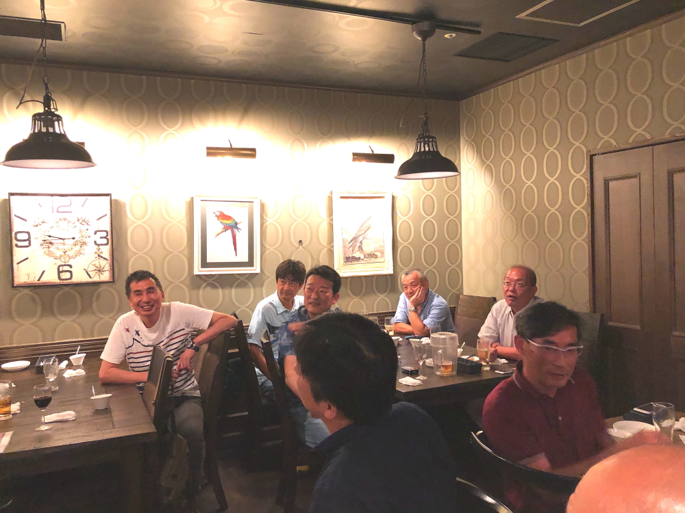
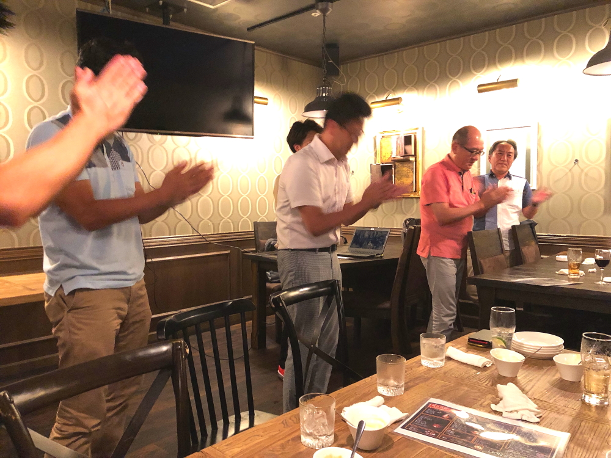

# 2019Aug_1g1

<html>
<head>

<meta charset="UTF-8">
<meta http-equiv="Content-Type" content="text/html; charset=UTF-8">
<meta http-equiv="X-UA-Compatible" content="IE=EmulateIE10" />
<meta http-equiv="X-UA-Compatible" content="IE=edge">

<!--ここから上はお決まりの定型文です-->

<!--ここからが表現の書式などを決めるcssという部分-->

<link href="https://cdnjs.cloudflare.com/ajax/libs/lightbox2/2.7.1/css/lightbox.css" rel="stylesheet">

</head>

<body>

  モバイル端末をお使いの場合は、画面を横向きにすると
  より見やすくご覧頂けます。

 アクセス用QRコード

    
<!--ここまでは定型文としてそのままコピペして再利用します-->
    
<h1><marquee bgcolor="#ffff00">!!! 2019年8月2日_1G1,中間報告会＠LION'S HEAD !!!</marquee></h1>

<MARQUEE width="30%" direction="right" 
scrollamount="20">(^_^)/~hada</MARQUEE>

                         
	

 

                         
                          

<footer>
    <h2>Copyright S.Hada 2019/Aug/02 HGT,1G1</h2>
</footer>
    
<!--HPにさまざまなJavaScriptを呼び込むための書式-->

